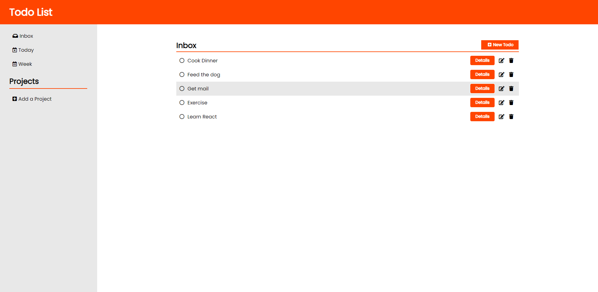

## Todo List
- Live Demo: https://aidenm99.github.io/Todo-List/

### Features

- Save todo items to one of the default folders (Home, Today, Week) or create a custom project folder.
- View toto details, include the name, description, priority and due date of the todo.
- Three priority levels to assign a todo item
- Dynamically add, edit or remove todos
- Fully responsive
- All data saved to local storage 

