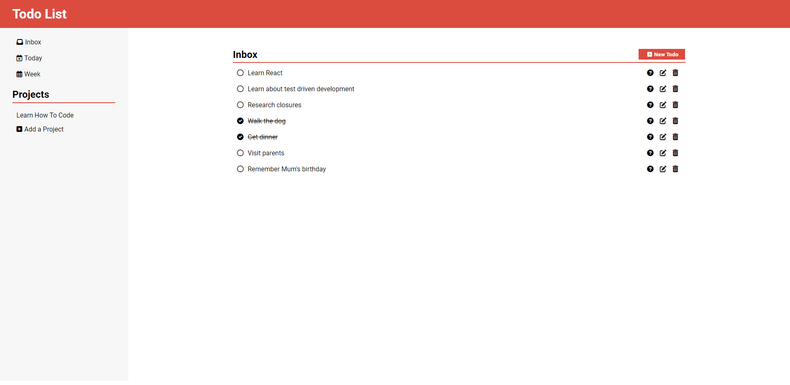
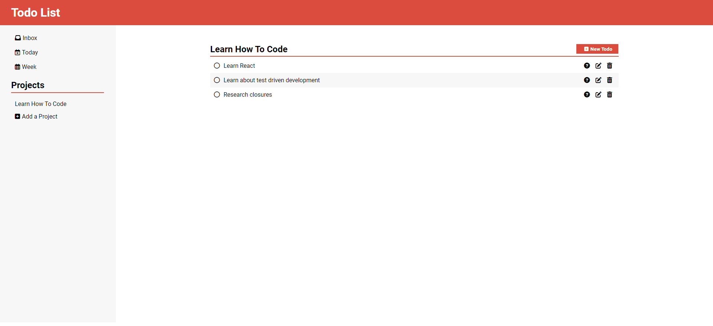
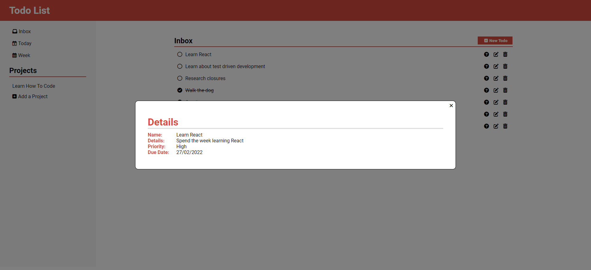
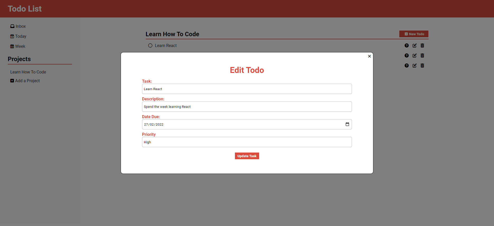
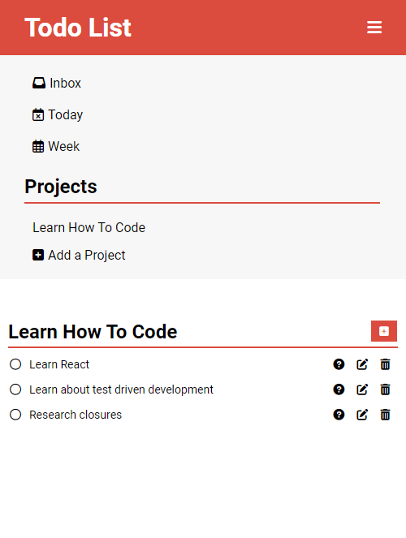

## Todo List
- Live Demo: https://aidenm99.github.io/Todo-List/

### Technologies Used
This project was built using:
- HTML5
- CSS
- JavaScript
- Webpack

### Features
- Save todo items to one of the default folders (Home, Today, Week) or create a custom project folder
- View toto details, including the name, description, priority and due date of the todo
- Three priority levels to assign a todo item
- Dynamically add, edit or remove todos
- All data saved to local storage
- Fully responsive

### Screenshots
- An overview of the Application

- Create projects and place tasks in them

- View more info about a task

- Edit tasks

- Mobile view

